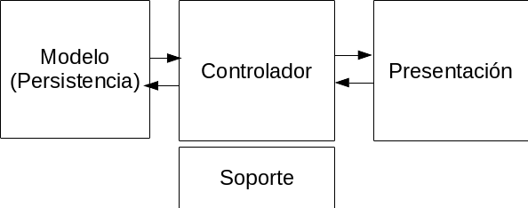

# PayFact
PayFact es una aplicacion que permite llevar un control de la recuperacion de cartera.
Realizada por estudiantes de Ingenieria de Sistemas de la EPN-Ecuador.
## Arquitectura
La aplicacion utiliza una arquitectura modificada basada en MVC (Modelo, Vista, Controlador).
El modelo proporciona la persistencia de los datos
La vista provee la presentacion de la aplicacion
El controlador es la capa intermedia entre la vista y el modelo.
La capa de soporte provee funcionalidades adicionales al controlador

## Principios
Los principios que regirán la grupo son:

### Integración Contínua
Asegurarnos de que el proyecto siga funcionando cuando se realizan
integraciones de las diferentes partes realizadas por los diferentes desarrolladores.

### Desarrollo Llevado por Pruebas (TDD)
Para poder asegurarnos que al momento de hacer un cambio el sistema
siga funcionando y cumpla con sus tareas.

## Reglas para aceptar un cambio
Se deberán seguir las siguientes reglas antes de realizar un cambio:
- El nuevo cambio siempre debe estar en una rama diferente a la principal.
- El proyecto debe compilar y pasar las pruebas en el servicio de integración continua.
- Se deberán corregir todos los comentarios propuestos por el grupo.

## Versionamiento
Se seguirá el siguiento formato para las versiones:
W.X.Y.Z

- W -> Nueva funcionalidad que añada valor al negocio.
- X -> Funcionalidad sobre funcionalidad, es decir, cualquier cosa que ayude o mejore al punto anterior (e.g. Funcionalidad para exportar a XML).
- Y -> Correcciones de issues, bugs, problemas de lógica, etc.
- Z -> Se agregan nuevas clases de soporte.
